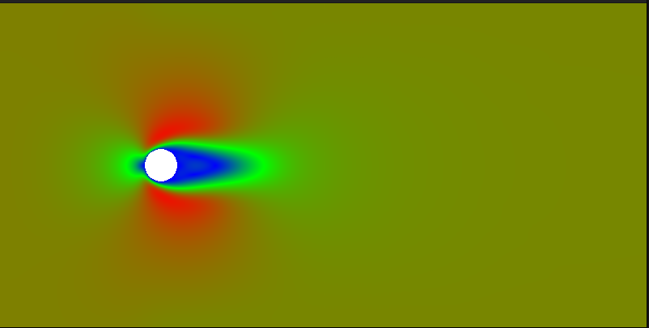

# Lattice Boltzmann Simulation

# Validation

## Poiseuille Test

The Poiseuille-test is one of the most used benchmarks to validate a CFD/LBM simulation, because it's one of the rare cases where the Navier-Stokes equations have an analytical solution.

## Working on...

- Benchmark data plotting
- Run on Personal Nvidia GPU

### OpenMP Bench

